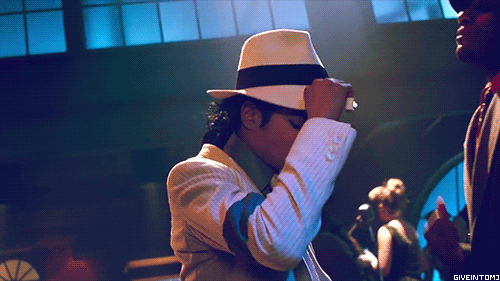

# The Rock Says

Hello I'm <em style="color: #333" >TheRockSays</em>, a brazilian guy persona/alter ego.

I'm a simple guy with a dream of being a game developer.

### Programming Languages

  
  
  
  

### Engines

  
  

#### Linux

After i started using Linux i'm not going back to Windows, Windows isn't that bad but Linux is better and greater at what it does, and i'll trying to make Linux good at things that its not great already like...Games. (Of Course Wine/Proton helped our community, but thats not enough)

As a Linux user, i'm a supporter of FOSS (Free and Open Source Software), and because of that i use mainly Godot Engine.

#### My Specs
  

  

  

  
##### More About Me

I don't know if i made it clear above, but i'm a Michael Jackson fan.

I'm also like to play some games like League of Legends, Valorant, CSGO, Motorsport Manager, Minecraft, and LEGACY OF KAIN.

I'm a Botafogo Futebol e Regatas fan, a traditional club in Brazil who is the team which has gave the most players to Brazil National Squad at Football/Soccer World Cup.
  
#### Contact

  
  
  
  

